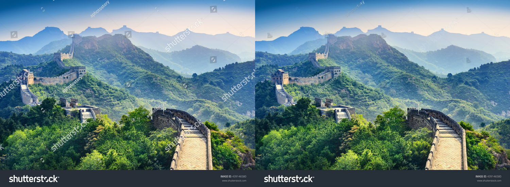

# Watermark Remover

This is a Deep learning project that removes watermarks and is based on noise2noise modifications. The original project is from https://github.com/yu4u/noise2noise

# Detailed instructions for use
[Detailed instructions for use](doc/detailed_usage.md)
https://www.zhihu.com/question/333086833/answer/841650555

# Video demonstration
https://www.bilibili.com/video/av67886721

The traditional method of image watermark removal is efficient, but it is more damaging to the details. Removing watermarks is simple and easy to say, and hard to do. Some watermarks with repair stamp take a few seconds to remove, some watermarks take a couple of hours without being able to totally removed it correctly.

Some images that are not very rich in detail can be filled with near pixel by an image processing software such as Photoshop to cover up the watermark part, and you can achieve near perfect results.

# Watermark Removal
This is the result of 9 hours of training on the 1050ti, it may be a little dirty, but theoretically 20 hours or more of training is enough to reach a usable level (left is the original image, right is the de-watermarked image,) 

It is better than professional-grade software such as photoshop.

